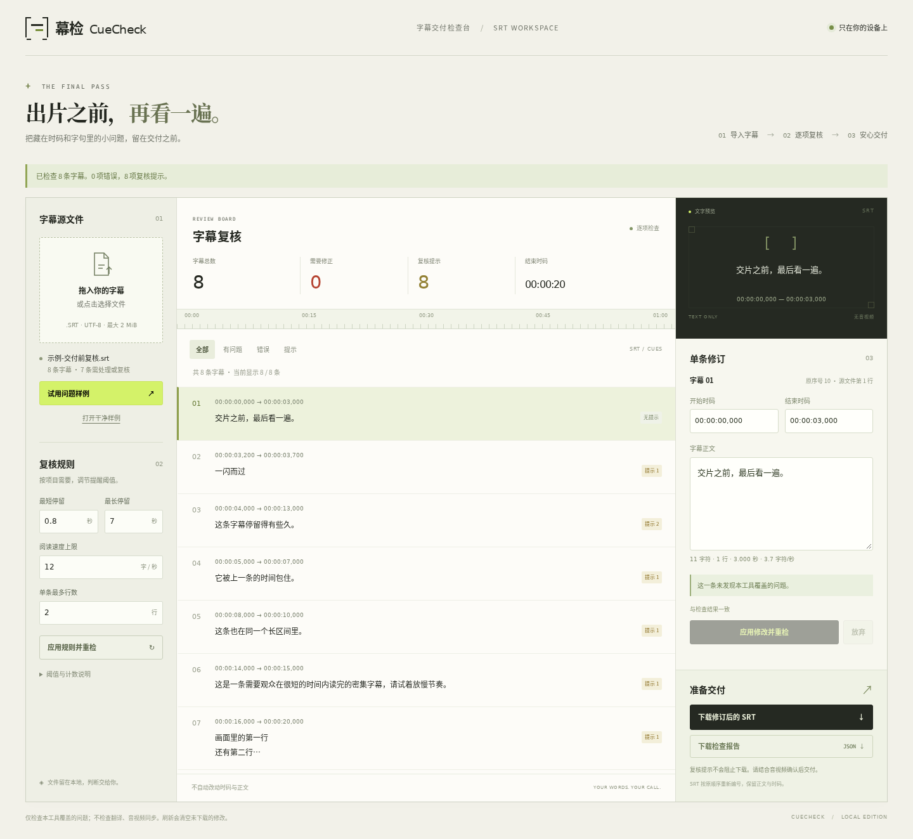

# 幕检 / CueCheck

在本地检查 SRT 字幕的时码、重叠与阅读负担，逐条修正后下载字幕和检查报告。适合交付前的一遍复核；无需账户、外部密钥或付费服务。

## 项目来源

本项目是 [Auto-Company](../../README-ZH.md) 自主运行生成的独立应用，不是 Auto-Company 本身或其控制台。人类仅下达启动指令和交付范围；从产品立项、方案讨论、设计开发到测试交付，均由 Agent 团队自主讨论、决策并执行，过程中无需人工介入。



## 启动

运行只需 Python 3 与现代浏览器，不需要安装 npm 依赖。在本目录执行：

```sh
python3 -m http.server 8766 --bind 127.0.0.1
```

打开 <http://127.0.0.1:8766>。WSL 用户可从 Windows 浏览器访问此地址。停止时在终端按 `Ctrl+C`。端口被占用时可替换为其他空闲端口；不要直接双击 HTML 文件。

## 使用

1. 打开或拖入一份 UTF-8 SRT；也可先点「问题样例」或「干净样例」。
2. 查看错误和复核提示，选择一条字幕调整开始、结束与正文。
3. 应用编辑后立即重新检查；也可修改检查阈值再应用。
4. 下载当前 SRT，或下载 JSON 检查报告。复核提示允许导出，硬错误必须先修正。

所有数据在浏览器内存中处理。刷新或关闭会清空文件与修改；未应用的编辑或未下载的修改会尝试触发浏览器离开确认，但这不是自动保存。字幕替换前有修改丢弃确认。先下载再关闭。

## 检查范围

| 类别 | 行为 |
| --- | --- |
| 结构解析失败 | 显示源文件行号；清空此前结果，不允许导出部分成功的字幕。请在原文件修正后重新导入 |
| 错误 | 结束不晚于开始、空正文、会破坏 SRT 分块的正文等，阻止 SRT 导出，仍可下载检查报告 |
| 复核提示 | 重叠、开始时间逆序、时长过短或过长、行数过多、每秒字符数过高；需要结合音视频判断 |
| 默认阈值 | 最短 0.8 秒、最长 7 秒、每秒 12 字符、最多 2 行；为本工具演示建议，可修改，并非平台合规认证 |
| 字符计数 | 按 Unicode 码点排除空白；标点与原文标签计入。组合字符、表情和标记可能使结果偏离实际阅读负担 |
| 统计 | 错误和提示按问题项计，同一条字幕可能有多项；结束时码取整份字幕最大结束值，不是时长总和 |

重叠检查会覆盖嵌套字幕。两条时间刚好相接不算重叠；每条参与重叠的字幕产生一项提示。工具保留原文件顺序，不自动移动时码、重排或修复内容。

## 输入与导出约定

| 项目 | 首版支持 |
| --- | --- |
| 输入 | 单个 UTF-8 SRT，可含开头 BOM；LF / CRLF 换行；最多 2 MiB、5,000 条 |
| 字幕块 | 独立数字序号、时间行、正文，块间用空行分隔。输入序号可不连续，数字原文保留在报告位置中 |
| 时码 | 严格 `HH:MM:SS,mmm --> HH:MM:SS,mmm`；小时 00–99，分秒 00–59，毫秒三位，箭头两侧需空格或制表符 |
| 不支持 | 非 UTF-8、点分隔毫秒、时码位置扩展、孤立 CR、NUL、无效 Unicode、模糊或损坏的块边界 |
| 正文 | 标签按原文显示和保留，不渲染 HTML；正文内部不可有空行，也不可含容易误识别为新字幕的数字行 + 时间箭头组合 |
| SRT 导出 | 按当前顺序重新编号为 1…N、统一 LF 换行、不含 BOM，保留当前正文与时码；导出同样限制 2 MiB |
| JSON 报告 | 含版本、文件名、规则、计数口径、统计和每个问题的原始位置及当前时码，不包含全部字幕正文 |

UTF-8 是本产品的支持范围，不是所有 SRT 的统一编码标准。首次导入即使时码有效，正文为空也会被本工具视为交付错误。这是产品检查约定。

块间分隔行必须没有任何字符；仅含空格或制表符的行仍按正文处理。样例加载期间暂时锁定编辑，避免异步读取覆盖新草稿。

修改未应用、规则未重检时暂停两种下载，避免报告与当前输入不一致。字幕列表每次显示最多 100 条，可继续加载；筛选和列表截断不影响全量分析或导出。源文件不被写回。

## 样例

- `examples/problem.srt`：8 条合成课程字幕，覆盖过短、过长、阅读速度、行数、逆序和重叠提示，没有硬错误，可以导出。
- `examples/clean.srt`：4 条合成字幕，在默认规则下没有问题。

样例只验证功能，不代表真实用户需求或商业验证。

## 检查与截图

核心检查使用 Node.js 20 或以上：

```sh
npm test
```

浏览器检查使用 Playwright，仅为开发依赖：

```sh
npm ci --cache .cache/npm
PLAYWRIGHT_BROWSERS_PATH=.cache/ms-playwright npx playwright install chromium
npm run test:browser
```

检查脚本自动启动并关闭一个临时回环静态服务，将截图、下载文件和结果放在忽略的 `test-artifacts/` 中。`CUECHECK_TEST_TOOLS` 可指向已有工具目录，只读使用其 Playwright、浏览器和 Linux 共享库；临时输出及字体缓存始终留在本产品目录。

如果相邻的 TableDelta 项目已安装浏览器测试工具，可直接复用：

```sh
CUECHECK_TEST_TOOLS=../tabledelta npm run test:browser
```

精简 Ubuntu / WSL 缺少浏览器共享库和中文字体时，可仅解包到当前产品缓存，不修改系统安装：

```sh
mkdir -p .cache/linux-debs
(cd .cache/linux-debs && apt-get download libnspr4 libnss3 libasound2t64 fonts-noto-cjk)
for package_file in .cache/linux-debs/*.deb; do
  dpkg-deb -x "$package_file" .cache/linux-libs
done
```

## 已知限制

- 无视频或音频，不检查翻译准确性、音画同步、镜头切换、字幕是否缺句；“未发现问题”只针对本工具覆盖的规则。
- 不支持 VTT/ASS、视频剪辑、自动翻译、批量文件、项目保存或云同步。
- 本地 Chromium 是本次验收环境；尚未实测所有浏览器、辅助技术和真实生产字幕。输入上限不是性能承诺。
- 页面无外部字体、CDN、遥测或业务 API；样例和资源由本地静态服务提供，字幕内容不上传。
- 尚无外部用户、收入或付费需求证据。成熟免费编辑器可能更适合完整字幕制作。
