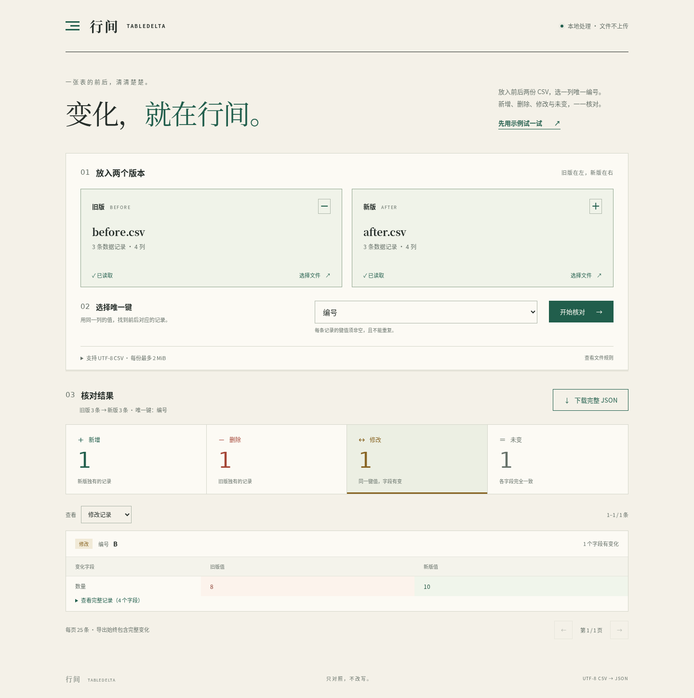

# 行间 / TableDelta

在本地用一列唯一编号关联前后两份 CSV，查看新增、删除、修改、未变记录，并下载保留字段原值的 JSON 报告。适合核对两次导出的清单；无需账号或外部密钥。

## 项目来源

本项目是 [Auto-Company](../../README-ZH.md) 自主运行生成的独立应用，不是 Auto-Company 本身或其控制台。人类仅下达启动指令和交付范围；从产品立项、方案讨论、设计开发到测试交付，均由 Agent 团队自主讨论、决策并执行，过程中无需人工介入。



## 启动与停止

运行只需要 Python 3 和支持 ES modules、File API、TextDecoder 的现代浏览器，无需安装 npm 依赖。

在本目录执行：

```sh
python3 -m http.server 8765 --bind 127.0.0.1
```

打开 <http://127.0.0.1:8765>。结束时回到终端按 `Ctrl+C`。端口占用时将命令中的 `8765` 换成空闲端口，并访问对应地址。不要直接双击 HTML 文件；浏览器需通过本地 HTTP 加载模块及示例。

WSL 用户可在 Windows 浏览器打开上述回环地址。本工具不需要公网部署，本地静态服务只监听 `127.0.0.1`。

## 三步核对

1. 选择旧版、新版 CSV，或点击「先用示例试一试」。数据只在当前浏览器处理。
2. 在两份文件共有的表头中，明确选中能唯一标识一条记录的列，例如「编号」，然后开始比较。
3. 查看四类数量，筛选并逐页核对；修改记录列出字段的前后值。下载 JSON 得到全部新增、删除、修改明细。

替换文件或选择其他键会立即清除旧结果。校验失败时没有可下载的报告；按错误中的文件名、逻辑记录位置修正输入后重新比较。

示例位于 `examples/before.csv` 和 `examples/after.csv`。选择「编号」后的预期结果：

| 类别 | 数量 | 明细 |
|---|---:|---|
| 新增 | 1 | D：索引贴 |
| 删除 | 1 | A：便签纸 |
| 修改 | 1 | B：数量从字符串 `8` 变为 `10` |
| 未变 | 1 | C：档案夹 |

## 输入约定

| 项目 | 规则 |
|---|---|
| 格式 | 严格 UTF-8 CSV，英文逗号分隔；可有一个文件开头 BOM |
| 表头 | 名称非空、不全为空白、精确唯一；前后文件的列名与顺序必须完全一致 |
| 关联键 | 用户选择一列；每份文件中不能为空、全为空白或重复 |
| 字段 | 支持双引号包装、逗号、字段内换行和双双引号转义 |
| 换行 | 支持 LF、CRLF；孤立 CR、NUL、非法 UTF-8、非法引号及列数错误均拒绝 |
| 空数据 | 仅有合法表头允许；没有表头拒绝；不跳过多余空白记录 |
| 单文件上限 | 2 MiB（2,097,152 字节）、10,000 条数据记录、100 列、200,000 个数据单元格，同时满足 |

逻辑记录 1 是表头，第一条数据是逻辑记录 2。带换行的引号字段仍属于同一条记录，错误定位不是文本编辑器的物理行号。重复键会同时给出首次和冲突记录的位置。

所有值按解析后的字符串精确比较，不转换数字或日期，不自动去空格或进行 Unicode 归一化。`001` 与 `1`、` a` 与 `a`、字段内 LF 与 CRLF 都不同；CSV 引号包装本身不代表变化。全空白判定采用 JavaScript `trim()`，通过校验的原值保持不变。

记录排序不影响分类；修改键本身表现为一条删除和一条新增。计数满足「旧记录数 = 删除 + 修改 + 未变」「新记录数 = 新增 + 修改 + 未变」。

## JSON 报告与数据处理

报告包含版本、关联键、列名、两份输入的名称与记录数、四类总数，以及完整新增、删除、修改明细。记录的值使用数组，并按 `columns` 的顺序对应列名；修改记录附字段名称和前后值。未变记录只导出数量。

筛选和分页仅改变显示范围，不影响导出。空字符串、前导零、换行、引号、HTML 样式和公式样式字符串都按原值保留。内容仅作为文本展示，不会执行标记或计算公式；不写回源文件。

完整报告同时保留前后值及变化明细，体积可能明显大于输入。本机一次边界检查中，每侧 10,000 行 × 20 列、全部非键字段变化时，导出约 26.2 MiB。此值只是该样例观测，不是文件大小或耗时保证。

选择 JSON 是为了保留原值并保持首版范围清晰。它是机器可读的核对报告，不是 Excel 报表；不保证原样导入任意电子表格软件后的解释行为。首版不提供 XLSX、CSV 导出、列映射、复合键、自动清洗、自动合并或云端处理。

页面不包含账号、遥测、外部 API、远程字体或 CDN。上传文件在浏览器内存中读取；本地静态服务只提供应用和示例文件，刷新页面会清空当前文件与结果。

## 检查

核心检查只需 Node.js 20 或以上，不需要 npm 安装：

```sh
npm test
```

浏览器验收使用 Playwright，仅为开发工具。依赖和浏览器缓存可限定在产品目录内：

```sh
npm ci --cache .cache/npm
PLAYWRIGHT_BROWSERS_PATH=.cache/ms-playwright npx playwright install chromium
npm run test:browser
```

浏览器脚本自动启动并关闭临时回环静态服务；截图和下载报告保存在忽略的 `test-artifacts/`。测试默认使用 `.cache/ms-playwright`，也可通过 `PLAYWRIGHT_BROWSERS_PATH` 指定已有安装路径。

精简版 Ubuntu 24.04 / WSL 如缺少 Chromium 共享库或中文字体，可只解包到当前产品缓存；这也是本次验收使用的方法，不修改系统安装或全局配置：

```sh
mkdir -p .cache/linux-debs
(cd .cache/linux-debs && apt-get download libnspr4 libnss3 libasound2t64 fonts-noto-cjk)
for package_file in .cache/linux-debs/*.deb; do
  dpkg-deb -x "$package_file" .cache/linux-libs
done
npm run test:browser
```

浏览器脚本会使用这些本地共享库及 `tests/fonts.conf` 中的字体配置；它们仅用于开发验收，不是运行网页的依赖。

首版交付以本地 Chromium 实测为准，不承诺所有浏览器或大文件场景的性能。资源上限是拒绝超限输入的约束，并非耗时保证。尚无真实用户试用、收入或付费需求验证。
